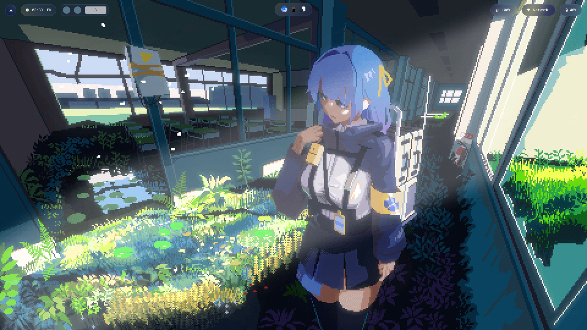
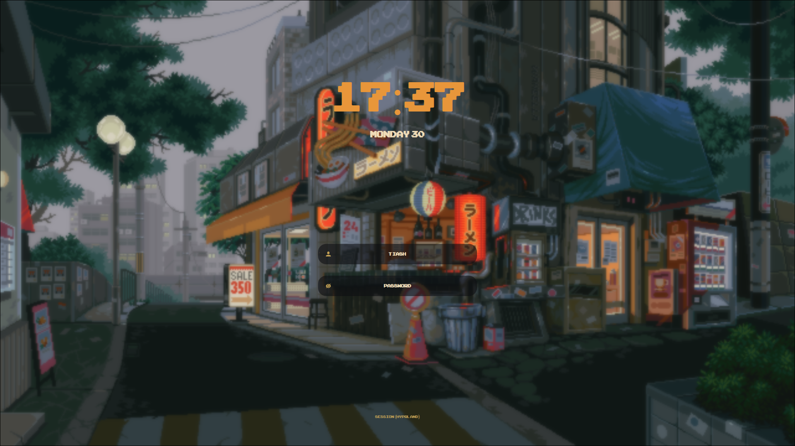
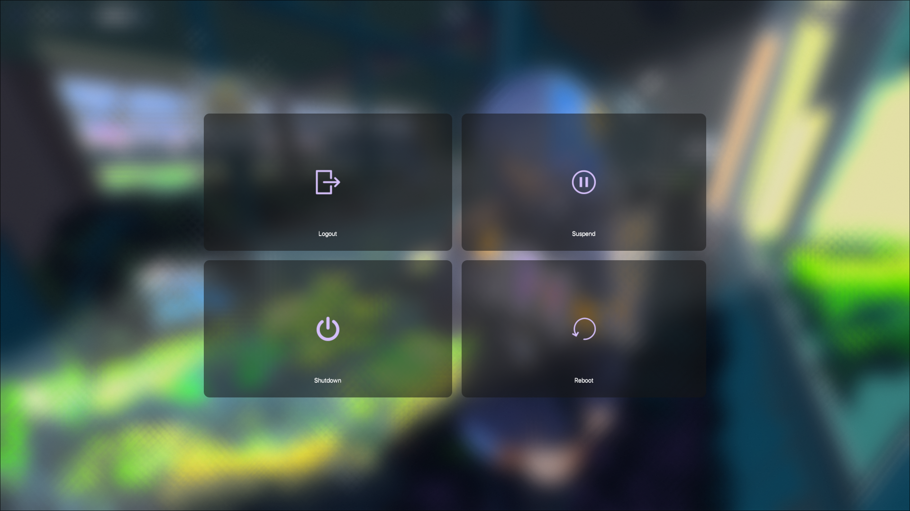
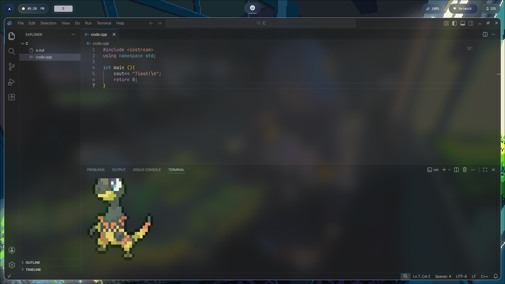
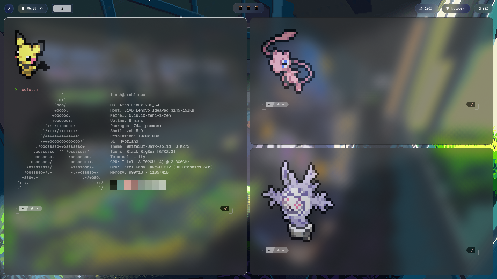

# Arch Linux Rice

> **Note:** This repo contains configuration files that may reference or depend on third-party packages. I do not own any of them — full credit goes to their respective creators. All listed packages are free and open-source software (FOSS). If any of my personal details are found, please inform me immediately, I'll remove please.

## ✨ Showcase

### 🖥️ Desktop Environment
The core of the setup featuring hyprland.


### 🔑 Lockscreen
*Lockscreen uses an sddm theme. (Theme doesn't belong to me.)*
<br> 

### 🚪 Power menu
*Wlogout custom menu w css blur.*
<br>

### 🛠️ Development Tools
My daily drivers for coding and terminal productivity.

*VSCodium with a custom CSS blur and Nord-inspired palette.*


*Zsh + Fastfetch + Custom Prompt.* 
## Install

```bash
sudo pacman -S yay wayland hyprland xorg-xwayland linux-zen

yay -S mpvpaper breeze-cursors cava wlogout plymouth zsh \
  ungoogled-chromium-bin waybar spotify-adblock spicetify kitty sddm \
  nautilus rofi neovim vscodium-bin obsidian pulseaudio pavucontrol \
  blueman-manager wl-clipboard cliphist nwg-look neofetch btop
```
Install the above packages, and place the .config files in your home/username/.config folder.
Enable the services like bluetooth, download the gtk themes and implement them in nwg-look.
Set linux-zen as default kernel and set timeout to 0 in systemmd config file to make boot faster, also use zram.
Link nvim's config to sudo/nvim's config to apply the nvim theme globally.
Install [plymouth](https://www.youtube.com/watch?v=tiOUNC-Q0xY&t=311s&pp=ygUIcGx5bW91dGg%3D) as the video shows.
Set sddm as your default login manager. Down here is the usage of all listed modules !

---

## Packages

| Package | Description |
| --- | --- |
| `wayland` | Display protocol |
| `hyprland` | Wayland compositor / window manager |
| `xorg-xwayland` | X11 compatibility layer for Wayland |
| `linux-zen` | Performance-tuned kernel |
| `zsh` | Shell |
| `kitty` | OpenGL terminal emulator |
| `mpvpaper` | Animated wallpaper via mpv |
| `waybar` | Status bar |
| `rofi` | App launcher |
| `wlogout` | Logout / shutdown / reboot / sleep menu |
| `cava` | Terminal audio visualiser |
| `plymouth` | Boot splash screen |
| `sddm` | Login manager |
| `nautilus` | File manager |
| `neovim` | TUI code editor |
| `vscodium-bin` | GUI code editor |
| `obsidian` | Note-taking app |
| `ungoogled-chromium-bin` | Chromium without Google services |
| `spotify-adblock` | Spotify with ads blocked |
| `spicetify` | Spotify theming |
| `pulseaudio` | Audio server |
| `pavucontrol` | GUI audio manager |
| `blueman-manager` | Bluetooth manager |
| `wl-clipboard` + `cliphist` | Wayland clipboard + history |
| `nwg-look` | GTK theme config |
| `neofetch` | System info in terminal |
| `btop` | System monitor |
| `breeze-cursors` | Cursor theme |

---

## Install Separately

| Tool | Description |
| --- | --- |
| [Powerlevel10k](https://github.com/romkatv/powerlevel10k?tab=readme-ov-file#installation) | Zsh prompt theme |
| [GeistMono Nerd Font](https://www.nerdfonts.com/font-downloads) | Terminal font |
| [SF Pro Display](https://github.com/sahibjotsaggu/San-Francisco-Pro-Fonts) | System font for Chromium |
| NextDNS | DNS-level ad and tracker blocking |

---

## GTK Theme

| | |
| --- | --- |
| Theme | [WhiteSur-Dark](https://github.com/vinceliuice/WhiteSur-gtk-theme?tab=readme-ov-file) |
| Icons | BlackBig-Sur |

---

## System Tweaks

| Tweak | Purpose |
| --- | --- |
| `zram` | Compressed RAM swap |
| `cpugovernor` | CPU power mode management |

---

## Notes

**Plymouth** — Skip boot timeout in systemd config, use Pack 3 Lone theme from [`plymouth-themes`](https://github.com/adi1090x/plymouth-themes), add `quiet splash` to kernel parameters.

**Spotify** — Install `spotify-adblock` first, then apply theme with `spicetify` using Text theme with spotify color scheme.


---
<p align="right">
  
</p>
